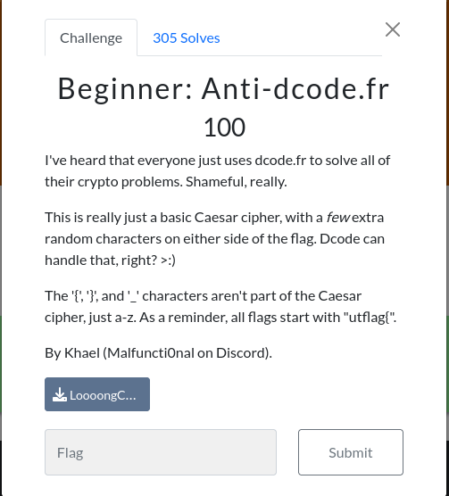

<!-- 
<h3 align="center">CS student and a passionate web developer</h3> -->

<p align="center">
  <a href="https://github.com/youcefimohamed">
    
  </a>
</p>

##  Beginner: Anti-dcode.fr   	

### Infos About challenge : 




### Description : 

##### I've heard that everyone just uses dcode.fr to solve all of their crypto problems. Shameful, really. This is really just a basic Caesar cipher, with a few extra random characters on either side of the flag. Dcode can handle that, right? >:) The '{', '}', and '_' characters aren't part of the Caesar cipher, just a-z. As a reminder, all flags start with "utflag{".


## solution:


##### With the help of ChatGPT, I wrote this script that decodes Caesar cipher with Python. Here is the script.

```
def decrypt(text, shift):
    decrypted_text = ""
    for char in text:
        if char.isalpha(): 
            shifted = ord(char) - shift
            if char.islower(): 
                if shifted < ord('a'):
                    shifted += 26
            elif char.isupper(): 
                if shifted < ord('A'):
                    shifted += 26
            decrypted_text += chr(shifted)
        else:
            decrypted_text += char
    return decrypted_text


with open("./Challange/cipher.txt", 'r') as file:
    encrypted_text = file.read()

for shift in range(26):
    decrypted_text = decrypt(encrypted_text, shift)
    if "utflag" in decrypted_text:
        index_flag = decrypted_text.index('utflag')
        print(decrypted_text[index_flag:index_flag+17])
        
```

### Flag:

`utflag{rip_dcode}`
