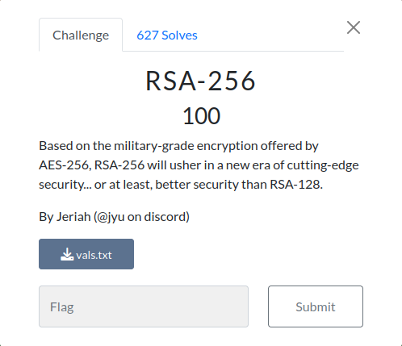
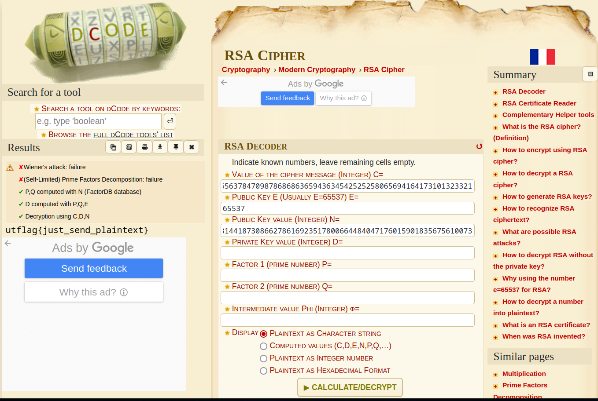

<!-- 
<h3 align="center">CS student and a passionate web developer</h3> -->

  

## RSA-256

### Infos About challenge : 

### Description : 

##### Based on the military-grade encryption offered by AES-256, RSA-256 will usher in a new era of cutting-edge security... or at least, better security than RSA-128.

## solution:

I solve it with  https://www.dcode.fr/rsa-cipher

### Flag:

`utflag{just_send_plaintext}`
