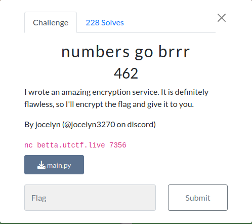

<!-- 
<h3 align="center">CS student and a passionate web developer</h3> -->

<p align="center">
  <a href="https://github.com/youcefimohamed">
    
  </a>
</p>

##   numbers go brrr  	

### Infos About challenge : 




### Description : 

##### I wrote an amazing encryption service. It is definitely flawless, so I'll encrypt the flag and give it to you.


## solution:


##### He gave me a netcat server that provides the choice between 1 - getting the encrypted flag, 2 - encrypting a message. Upon reading the code, we find that it generates the key with the following function 
```
seed = random.randint(0, 10 ** 6)
def get_random_number():
    global seed 
    seed = int(str(seed * seed).zfill(12)[3:9])
    return seed
key = b''
for i in range(8):
    key += (get_random_number() % (2 ** 16)).to_bytes(2, 'big')
```

##### and we notice that the seed is a small number (it is between 0 and 100000), so we can brute force the key. Here is the solving code:

```
from Crypto.Cipher import AES
from Crypto.Util.Padding import unpad, pad

def get_random_number():
    global seed 
    seed = int(str(seed * seed).zfill(12)[3:9])
    return seed


def decrypt(c):
    key = b''
    for i in range(8):
        key += (get_random_number() % (2 ** 16)).to_bytes(2, 'big')
    
    cipher = AES.new(key, AES.MODE_ECB)
    plain = cipher.decrypt(pad(c, AES.block_size))
    return plain ,key 
    
c='7532ba563a60d4ff2c98f04548c56407322b732762ea6a4b4acd0e2f8965e0572f58d256f5cf9b23a9d22e0eda913ecf'
ciphertext = bytes.fromhex(c)
for i in range(1000000):
    seed = i
    flag,key=decrypt(ciphertext)
    if b'utflag{'in flag:
        print(flag)
        print(key)
        break
        
```

### Flag:

`utflag{deep_seated_and_recurring_self-doubts}`

